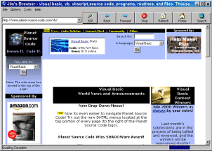



## Better Web Browser

### Description

This is a web browser with a few additions. First, it has picture buttons like IE, a 'history' file that is editable. A built in search engine, quick IP address, disable pop-ups option and more. Check it out.
 
### More Info
 

             |
---                |---
**Submitted On**   |2000-07-06 19:24:02
**By**             |[James Compton](https://github.com/Planet-Source-Code/PSCIndex/blob/master/ByAuthor/james-compton.md)
**Level**          |Beginner
**User Rating**    |4.6 (23 globes from 5 users)
**Compatibility**  |VB 5\.0, VB 6\.0
**Category**       |[Complete Applications](https://github.com/Planet-Source-Code/PSCIndex/blob/master/ByCategory/complete-applications__1-27.md)
**World**          |[Visual Basic](https://github.com/Planet-Source-Code/PSCIndex/blob/master/ByWorld/visual-basic.md)
**Archive File**   |[CODE\_UPLOAD7487762000\.zip](https://github.com/Planet-Source-Code/james-compton-better-web-browser__1-9557/archive/master.zip)

